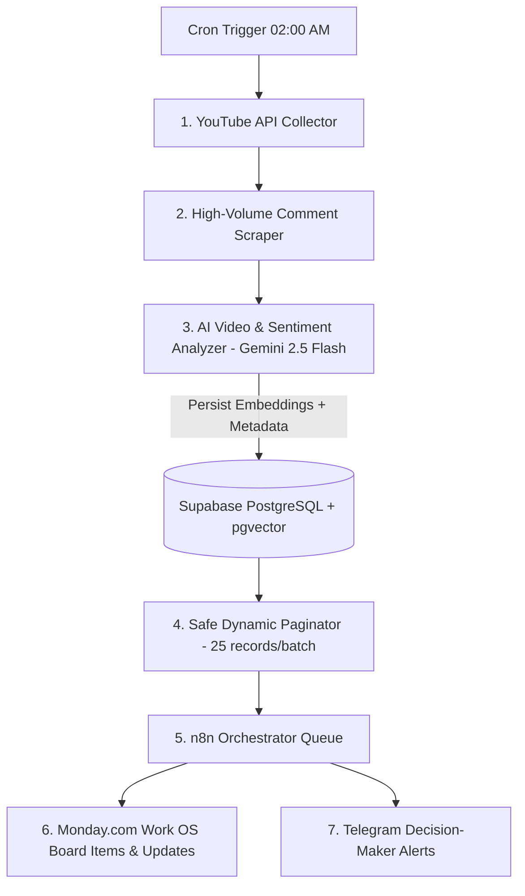

# 🏆 Trend Intelligence Engine — High-Throughput Semantic Listening & Social RAG

[](https://github.com/jraphaelbarbosa/trend-intelligence-engine)


> **[ 🇧🇷 Ler em Português ](README.pt-br.md)**

> **Executive Overview:** The **Trend Intelligence Engine** is an enterprise-grade social listening, competitive intelligence, and semantic sentiment analysis platform. Operating on a **Software "Dark Kitchen"** architecture, heavy data processing, scraping, and AI cognitive enrichment run in isolation in Python in the background, while the operational user interface is streamlined into enterprise Work OS dashboards (**Monday.com**) and messaging channels (**Telegram**), orchestrated via **n8n v2**.

---

## 🏗️ 1. System Architecture ("The Dark Kitchen")

The data pipeline runs synchronously, robustly, and modularly, separating intelligence from infrastructure:



### 📡 Pipeline Layers
* **Ingestion (YouTube API v3):** Filter mid-to-large creators and high-velocity discussions, evaluating consistent engagement rates across video batches.
* **Semantic Corpus (Comments Extraction):** Automated extraction of high-relevance comments per video for deep sentiment mining.
* **Cognitive Engine (Gemini 2.5 Flash + pgvector):** Ingests comment corpus + literal video transcriptions. The model contrasts **Creator's Thesis (Narrative)** vs. **Audience's Real Reaction (Friction/Adoption)**, generating 768-dimensional embeddings persisted in Supabase.
* **UI Dispatcher (n8n GraphQL):** n8n polls the database queue in dynamic batches of 25 records (safety pagination preventing Node.js buffer overflows) and issues strict GraphQL requests to Monday.com, creating items and attaching rich HTML dossiers with AI comparative analysis.

---

## 🛡️ 2. Enterprise Reliability & Design Decisions

### ⚡ Memory Buffer Overflow Mitigation
* In high-throughput executions (150k+ processed comments), standard batch serialization frequently triggered Node.js's runtime failure `stdout maxBuffer length exceeded (1MB)`.
* **Architectural Fix:** Implemented deterministic cursor-based pagination restricting each batch payload to ~325KB, guaranteeing zero memory overflow across Cloud Run container runners.

### 📐 Strict Data Contracts (Pydantic v2)
* Upgraded data boundaries between scrapers, analyzers, and exporters to strict `BaseModel` classes (`VideoMetadata`, `CommentPayload`, `SentimentAnalysisResult`, `MondayItemPayload`).
* Prevents data corruption and ensures schema evolution compatibility across n8n webhook nodes.

### 🧪 Deterministic Pytest Test Suite
* Complete automated test suite covering sentiment classification heuristics, data contract validation, section parsing, and Monday GraphQL API mocks.
* Runs in **< 1.0 second** with zero API token consumption during CI.

---

## ⚽ 3. Production Pilot: 2026 FIFA World Cup

To demonstrate framework capabilities in a production scenario, a pilot use case was configured focusing on **2026 FIFA World Cup** ecosystem trends:

* **Processed Volume:** **163 high-impact videos** and thousands of comments structured and vectorized.
* **Dynamic Modularity:** The engine analyzes sub-topics (*Panini Stickers*, *Tactical Analysis*, *Call-up Drama*, *Cost Controversies*, *Influencer Reactions*) and creates matching groups dynamically directly inside the Monday.com board.
* **Enterprise Stability:** **0% cognitive failures**, with pagination restricting stdout to a safe ~325KB.
* **Pilot Parameters:** All keyword mappings and analytical parameters are isolated in `src/pilots/world_cup_2026/config.yaml`.

---

## 🚀 4. How to Run Locally

### Prerequisites
* Python 3.11+
* Docker & Docker Compose
* Configured API Keys (YouTube, Gemini, Monday.com, Supabase)

### Setup & Testing
```bash
# 1. Clone repository
git clone https://github.com/jraphaelbarbosa/trend-intelligence-engine.git
cd trend-intelligence-engine

# 2. Setup virtual environment
python -m venv venv
source venv/bin/activate  # On Windows: venv\Scripts\activate

# 3. Install dependencies
pip install -r requirements.txt

# 4. Run automated test suite
pytest tests/ -v --cov=src

# 5. Run linter
ruff check src/ tests/
```

### Running Services with Docker
```bash
docker compose -f docker/docker-compose.yml up --build -d
```
The n8n web console will be accessible at [http://localhost:5678](http://localhost:5678).

---

## 📂 5. Canonical Repository Structure

```text
trend-intelligence-engine/
├── .github/
│   └── workflows/
│       ├── ci.yml                     # Automated Lint & Pytest Quality Gate
│       └── google-cloudrun.yml        # Google Cloud Run Deployment
├── docker/                            # Multi-stage Dockerfile & Compose
├── n8n/                               # Orchestrator workflow export
├── src/                               # Core Python source code
│   ├── models/
│   │   └── schemas.py                 # Pydantic v2 Strict Data Contracts
│   ├── collector.py                   # YouTube API collection
│   ├── scraper.py                     # Comment extraction pipeline
│   ├── analyzer.py                    # Gemini cognitive processing & embeddings
│   ├── fetcher.py                     # Synchronous DB pagination & Monday helpers
│   ├── export_to_monday.py            # Direct Monday GraphQL exporter
│   ├── telegram_oraculo.py            # Conversational alert agent
│   ├── utils/
│   │   └── db.py                      # Supabase relational connection pooling
│   └── pilots/
│       └── world_cup_2026/            # Pilot runner & configuration
├── scripts/
│   └── ops/                           # Isolated database maintenance & operational utilities
├── tests/
│   ├── conftest.py                    # Pytest global fixtures & API mocks
│   └── unit/
│       ├── test_schemas.py            # Pydantic data contract tests
│       ├── test_fetcher.py            # Transformation & mapping tests
│       └── test_analyzer.py           # Video ID extraction & context tests
├── requirements.txt                   # Production dependencies
└── README.md                          # Technical documentation
```

---

## 🗺️ 6. Roadmap
- [ ] **Insights RAG:** Implement natural language semantic search directly on Monday.com boards connected to Supabase vector storage.
- [ ] **Multitenancy Configuration:** Allow multiple Monday.com boards to connect to the same Cloud Run instance, routing via tokens in n8n requests.
- [ ] **Proactive Telegram Push:** Automated daily insight dispatch to stakeholders every morning.
