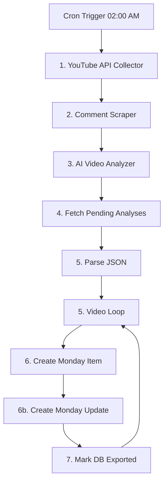

# 🏆 Trend Intelligence Engine

> **[ 🇧🇷 Ler em Português ](README.pt-br.md)**

[](https://n8n.io)
[](https://deepmind.google/technologies/gemini/)

The **Trend Intelligence Engine** is a senior hybrid competitive intelligence and semantic sentiment analysis orchestrator. Operating on a **Software "Dark Kitchen"** architecture, heavy data processing, scraping, and AI cognitive enrichment run in isolation in Python in the background, while the operational user interface is streamlined into enterprise dashboards in **Monday.com**, orchestrated via **n8n v2**.

---

## 🏗️ 1. System Architecture ("The Dark Kitchen")

The data pipeline runs synchronously, robustly, and modularly, separating intelligence from infrastructure:



### 📡 Pipeline Layers
* **Ingestion (YouTube API v3):** Python scripts filter mid-to-large independent creators, evaluating consistent engagement rates across video batches.
* **Semantic Corpus (Comments Extraction):** Automated and structured extraction of the top 100 most relevant comments for each newly discovered video.
* **Cognitive Engine (Gemini 2.5 Flash + pgvector):** Ingests comment corpus + literal video transcriptions. The AI synthesizes critical contrast: **Creator's Thesis (Narrative)** vs. **Audience's Real Reaction (Friction/Adoption)**, generating 768-dimensional embeddings persisted in Supabase.
* **UI Dispatcher (n8n GraphQL):** n8n polls the database queue in dynamic batches of 25 records (safety pagination preventing Node.js buffer overflows) and issues strict GraphQL requests to Monday.com, creating items and attaching rich HTML speech bubbles with AI comparative analysis.

---

## ⚽ 2. Pilot Success Case: 2026 FIFA World Cup

To demonstrate framework capabilities in a production scenario, a pilot use case was configured focusing on **2026 FIFA World Cup** ecosystem trends:

* **Processed Volume:** **163 high-impact videos** structured and vectorized.
* **Dynamic Modularity:** The engine analyzes sub-topics (*Panini Stickers*, *Tactical Analysis*, *Call-up Drama*, *Cost Controversies*, *Influencer Reactions*) and creates matching groups dynamically directly inside the Monday.com board.
* **Enterprise Stability:** **0% cognitive failures**, with pagination restricting stdout to a safe ~325KB (resolving Node.js's classic `stdout maxBuffer length exceeded` 1MB bottleneck).
* **Pilot Parameters:** All keyword mappings and analytical parameters are isolated in `src/pilots/world_cup_2026/config.yaml`.

---

## 🚀 3. How to Run Locally

### Prerequisites
* Docker & Docker Compose
* Configured API Keys (YouTube, Gemini, Monday.com, Supabase)

### Environment Variable Setup
1. Copy the example configuration file:
   ```bash
   cp .env.example .env
   ```
2. Open `.env` and fill in your API credentials.

### Starting Services with Docker
To launch the engine and n8n orchestrator locally, run from the root directory:
```bash
docker compose -f docker/docker-compose.yml up --build -d
```
The n8n web console will be accessible at [http://localhost:5678](http://localhost:5678).

---

## 📂 4. Canonical Repository Structure

```text
├── .github/workflows/          # CI/CD on Cloud Run
├── docker/                     # Multi-stage Dockerfile & Compose
├── n8n/                        # Orchestrator workflow export
├── src/                        # Python source code
│   ├── collector.py            # YouTube API collection
│   ├── scraper.py              # Comment extraction
│   ├── analyzer.py             # Gemini processing & embeddings
│   ├── fetcher.py              # Synchronous DB pagination
│   ├── utils/
│   │   └── db.py               # Supabase relational module
│   └── pilots/
│       └── world_cup_2026/     # Pilot runner & configuration
├── requirements.txt            # Python dependencies
└── README.md
```

---

## 🗺️ 5. Roadmap
- [ ] **Insights RAG:** Implement natural language semantic search directly on Monday.com boards connected to Supabase vector storage.
- [ ] **Multitenancy Configuration:** Allow multiple Monday.com boards to connect to the same Cloud Run instance, routing via tokens in n8n requests.
- [ ] **Telegram Agent Integration:** Conversational agent sending morning insight reports to decision-makers in real time.
